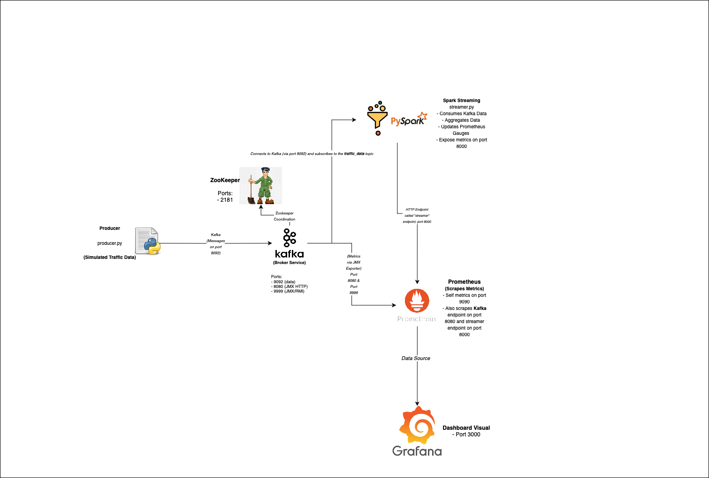

# Assignment 3 - Real-Time Data Streaming with Kafka, PySpark, Prometheus & Grafana

This project sets up a data streaming pipeline using Kafka, PySpark, Prometheus, and Grafana. All necessary components run in Docker containers. Two Python scripts (`producer.py` and `streamer.py`) handle real-time data flow, monitored through Grafana.

---

## 🧰 Prerequisites

- Docker & Docker Compose installed
- Python 3.x
- Java 17 installed (if running `streamer.py`)
- macOS users must be able to switch Java versions via terminal
- `screen` installed for background terminal sessions

---

## Architecture Diagram





## 🚀 Getting Started

### 1. Clone the repository

```bash
git clone https://github.com/pashari/AI601-A3.git
cd AI601-A3
```


---

### 2. Start Docker Containers

Run the following to start all services:

```bash
docker compose up -d
```

This starts:
- Kafka
- Zookeeper
- Prometheus
- Grafana

---

### 3. Start Producer and Streamer in Background Screens

#### Create separate terminal screens:

```bash
screen -S producer
```

In this screen:

```bash
cd producer
python3 producer.py
```

Press `Ctrl + A`, then `D` to detach and return to the main screen.

---

Then create another screen:

```bash
screen -S streamer
```

In this screen:

```bash
cd streamer
python3 streamer.py
```

---

## ⚠️ Java Version Note (macOS Only)

If you encounter a Java version error when running `streamer.py`, switch to Java 17:

### 👉 Step 1: Install Java 17 (if not installed)

```bash
brew install openjdk@17
```

### 👉 Step 2: Export Java 17

```bash
export JAVA_HOME=$(/usr/libexec/java_home -v 17) && export PATH=$JAVA_HOME/bin:$PATH
```

Then re-run `python3 streamer.py`

---

## ✅ Check Everything is Running

Back in the main terminal window:

### 1. See if all containers are running:

```bash
docker ps -a
```

You should see **4 containers**:
- kafka
- zookeeper
- prometheus
- grafana

No containers should be crashing or restarting repeatedly.

---

### 2. Visit Prometheus Targets

Open in your browser:

```
http://localhost:9090/targets
```

Make sure all **3 endpoints** show status as **UP**:
- Kafka
- Prometheus
- Streamer

This is required for correct data streaming and monitoring.

---

### 3. Check PySpark Output

Run:

```bash
curl http://localhost:8000
```

You should get a response with some output from your PySpark streamer.

---

## 📊 Grafana Setup

1. Open Grafana at [http://localhost:3000](http://localhost:3000)
2. Login using:

```
Username: admin
Password: admin
```

3. Add a new data source:
    - Type: **Prometheus**
    - URL: `http://prometheus:9090`

**Here’s what the setup looks like:**


4. Import dashboard:
    - Click **Import Dashboard**
    - Select "Upload .json file" or paste JSON
    - Use the file from `grafana-dashboard/your-dashboard.json`

**Example of the final dashboard:**


---

## 🧼 Clean-Up

To stop and remove all containers:

```bash
docker compose down
```

To kill the screen sessions:

```bash
screen -X -S producer quit
screen -X -S streamer quit
```

--- 

---

## 🧠 Tips

- Reattach screens with `screen -r producer` or `screen -r streamer`
- Check Docker logs with `docker logs <container-name>`
- Ensure `curl http://localhost:8000` returns data
- Make sure Java 17 is active if streamer gives Java-related errors

---

## ✅ Final Checklist

- [x] 4 Docker containers are running
- [x] All Prometheus targets are UP
- [x] Grafana connected to Prometheus
- [x] Dashboard imported and displaying data
- [x] PySpark returns data from `curl`

---


